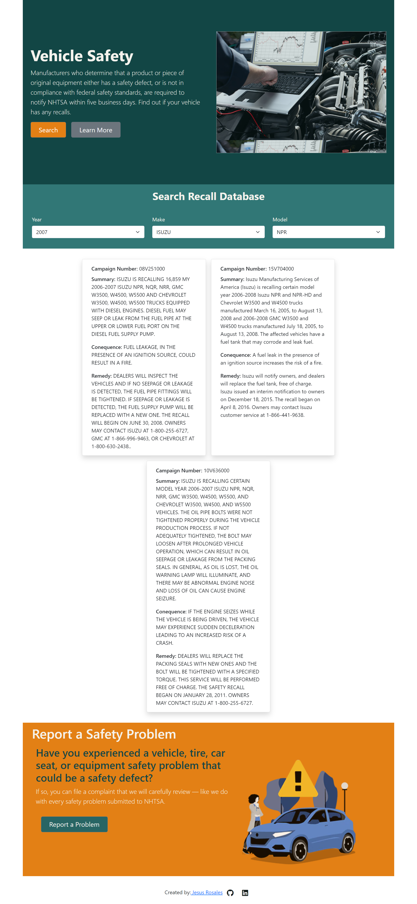

## Description

A simple web application that pulls data from the NHTSA vehicle recall database. Users can search any vehicle in the search bar.

## Screen Shot

## Techonologies Used

*React.Js
*Bootstrap
\*NHTSA recall API

## Available Scripts

In the project directory, you can run:

### `npm start`

Runs the app in the development mode.\
Open [http://localhost:3000](http://localhost:3000) to view it in your browser.

The page will reload when you make changes.\
You may also see any lint errors in the console.
